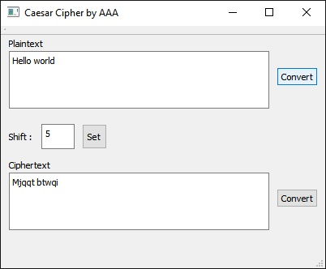

# Caesar-Cipher-with-QT-app-
Caesar Cipher application built with the help of QT framework
<html>

	<head>
		<title></title>
		
	</head>

	<body>

		<h2>What is Caeser Cipher?</h2>
		

		The Caesar cipher is one of the earliest known and simplest ciphers. It is a type of substitution cipher in which each letter in the plaintext is 'shifted' a certain number of places down the alphabet. For example, with a shift of 1, A would be replaced by B, B would become C, and so on. The method is named after Julius Caesar, who apparently used it to communicate with his generals.
		

		<h2>Out-look:</h2>
		
		<h2>What is does:</h2>
		<ul>
			<li>Takes characters from anyone of the text boxes</li>
			<li>Adds(cipher) or substracts(decipher) each of the alphabets by the shift number</li>
			<li>Displays the result in the other text box</li>
		</ul>
		<h2>How to use it:</h2>
		<ul>
			<li>Type your text in any one of the text boxes. To cipher a plain text, type in the Plaintext text box.To decipher use Ciphertext text box.</li>
			<li>By default the shift number is set to 5.To change type in a number in the field and hit "Set"</li>
			<li>Finally hit the convert button beside the text box you typed in.</li>
		</ul>
		<a href= "https://github.com/Anondo/Caesar-Cipher-with-QT" target = "_blank">Here is the source code of this app</a>

	</body>

</html>
